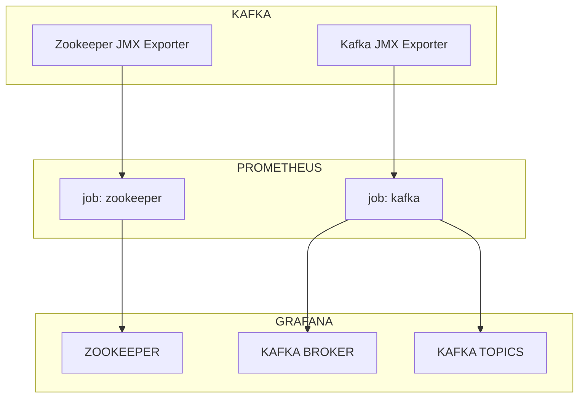

# Monitoring Confluent Open Source Kafka using JMX and Grafana
This details the steps to be taken to enable monitoring of Kafka and Zookeeper instances in Grafana via Prometheus Database. This is a reuse of the dashboards [published](https://github.com/confluentinc/jmx-monitoring-stacks.git) by Confluent with some enhancements

## Pre-Requisites
Complete the following pre-requisites.
 - Grafana
	 - Open Source solution that uses JSON based dashboards to publish the resource consumption in human readable format.
 - Prometheus
	 - A time series database that reads and stores metrics or resource utilization data
 - Confluent Open Source Kafka Cluster including Zookeeper (Should work for Apache Kafka as well)
	 - Confluent's version of Apache Kafka which doesn't include the proprietary components.

## System Requirements

 - Network connectivity between Prometheus Server and the Kafka Cluster
 - Standard JDK on Kafka Cluster (The JDK/JRE used by the Kafka Cluster can be re-used)

## Flow Diagram

The Kafka cluster and the underlying java application generates performance and other metrics using the in-built JMX Mbeans. These beans must be explicitly exposed for consuming and processing the data. Once this is done, a JAVA Agent such as the JMX Exporter is used to consume the data. Prometheus is then configured to read data by connecting to the JMX Exporter agent. Grafana allows creation of dashboards that reads data from Prometheus and publishes them in human readable format.




## Enabling JMX On Kafka and Zookeeper

Add the following properties to the Zookeeper and Kafka Startup environment file.

>  -Dcom.sun.management.jmxremote 
>  -Dcom.sun.management.jmxremote.authenticate=true 
>  -Dcom.sun.management.jmxremote.ssl=false 
>  -Dcom.sun.management.jmxremote.port=9686 
>  -Dcom.sun.management.jmxremote.access.file=/opt/confluent/confluent-6.0.1/bin/jmx.access 
>  -Dcom.sun.management.jmxremote.password.file=/opt/confluent/confluent-6.0.1/bin/jmx.password

It is recommended that authentication be enabled for connecting to JMX services and the role for said user be restricted to basic read access. SSL can be enabled for remote JMX connection as required.

## Enabling JMX Exporter for Kafka and Zookeeper

Prometheus should be able to connect to a compliant agent and read the data. For Java applications which uses JMX Mbeans to publish metrics, [JMX Exporter](https://github.com/prometheus/jmx_exporter) is the agent of choice. Perform the following steps to enable thye JMX Exporter Agent

 1. Download the JMX Exporter [JAR](https://github.com/prometheus/jmx_exporter/releases/tag/parent-0.17.2) file from GitHub
 2. Copy the application specific configuration YAML file that can parse the metrics from MBeans. For all standard applications and software this is [published](https://github.com/prometheus/jmx_exporter/tree/main/example_configs) and can be used as-is.
 3. Add the following property to the Zookeeper and Kafka Startup environment file
	 >  -javaagent:/opt/confluent/prometheus/jmx_prometheus_javaagent-0.16.1.jar=7071:/opt/confluent/prometheus/kafka-metric.yml
	 NOTE: The port 7071 can be changed as needed

## Configure Prometheus to Collect and Store Metrics

In order to publish the metrics as charts and graphs, the data should first be stored in a time series database. In this case, it is Prometheus. The **prometheus.yml** file controls what the prometheus instance collects and stores. Unlike other prometheus agents, data from JMX Exporter is pulled rather than pushed. prometheus.yml should have the scrape jobs defined that will collect data from Kafka and Zookeeper instances.
In the prometheus.yml file, add the following lines with proper syntax and restart Prometheus.

```
scrape_configs:
  - job_name: "prometheus"
    static_configs:
      - targets: ["eu-jenkint-a001.iconcr.com:9090"]

  - job_name: "kafka"
    static_configs:
      - targets:
          - "<node1>:7071"
          - "<node2>:7071"
          - "<node3>:7071"
        labels:
          env: "test"

  - job_name: "zookeeper"
    static_configs:
      - targets:
          - "<node1>:7171"
          - "<node2>:7171"
          - "<node3>:7171"
        labels:
          env: "test"
```
## Create Grafana Data Sources
Now that the Prometheus is collecting the data, Grafana must be configured to connect to the Prometheus instance and read the data. This Prometheus instance is configured as a **Data-Source** in Grafana. Refer Grafana manual for steps to create the data source.


## Create Grafana Dashboards

Grafana dashboards provides an intuitive and cleaner way to consume the resource usage data. The dashboards are essentially JSON files with pre-defined variables, annotations and various panels to publish statistics and charts. Until now, the configurations developed by confluent is used as-is. While the dashboard JSON provided by Confluent does the job, it has **Data Source** and **Prometheus Jobs** hard coded. The JSON files are now modified to prompt for the required **Data Source** while importing the JSON file. Refer Grafana manual for steps to import JSON files as dashboards.

NOTE: The Prometheus Job names are still hard-coded to not break the panel. if the naming convention given here is followed and the JSON and YAML files are used as-is, the dashboard will start publishing data immediately.
